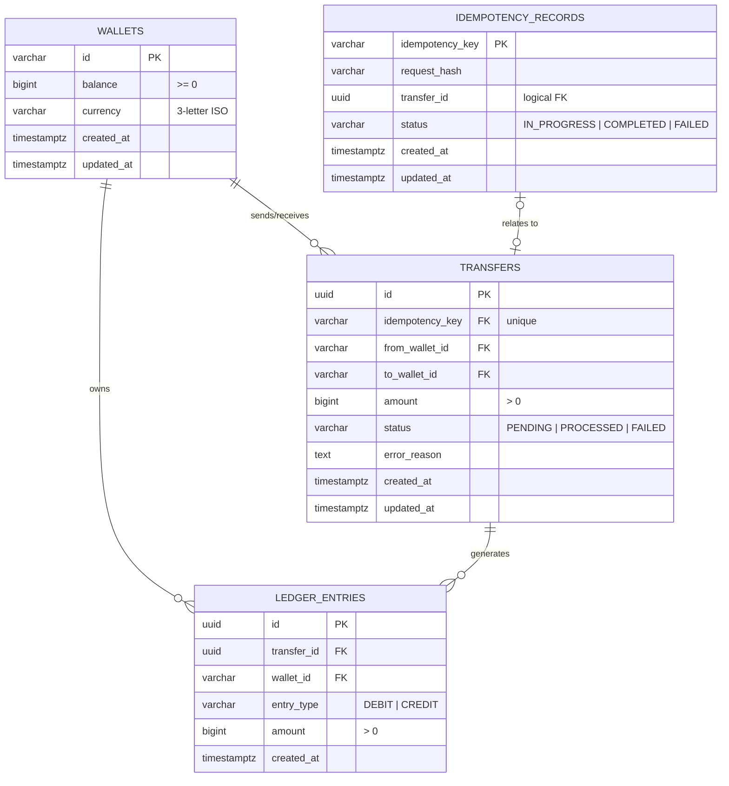

# Wallet Transfer Service

A reliable, atomic, and highly concurrent wallet-to-wallet transfer service implemented in Go and PostgreSQL, fully containerized using Docker.

This project implements a double-entry ledger system with strict idempotency guarantees, deadlock-free pessimistic concurrency control, and clean layered architecture.

---

## Table of Contents
1. [System Architecture](#system-architecture)
2. [Database Schema Design](#database-schema-design)
3. [Idempotency Strategy](#idempotency-strategy)
4. [Concurrency Control](#concurrency-control)
5. [Ledger Consistency & State Machine](#ledger-consistency--state-machine)
6. [API Specifications](#api-specifications)
7. [How to Build & Run](#how-to-build--run)
8. [Testing Suite](#testing-suite)
9. [Tradeoffs & Assumptions](#tradeoffs--assumptions)

---

## System Architecture

The service adheres to **Clean Architecture** principles, enforcing a strict separation of concerns into four distinct layers:

```
                  ┌──────────────────────────────┐
                  │          HTTP Client         │
                  └──────────────┬───────────────┘
                                 │ HTTP / JSON
                  ┌──────────────▼───────────────┐
                  │        Handler Layer         │ (request/response validation & mapping)
                  └──────────────┬───────────────┘
                                 │ Domain Models
                  ┌──────────────▼───────────────┐
                  │        Service Layer         │ (orchestration, TX bounds, business logic)
                  └──────────────┬───────────────┘
                                 │ DBTX Interface
                  ┌──────────────▼───────────────┐
                  │       Repository Layer       │ (SQL queries & database execution)
                  └──────────────┬───────────────┘
                                 │ pgx Driver
                  ┌──────────────▼───────────────┐
                  │          PostgreSQL          │
                  └──────────────────────────────┘
```

1. **Domain Models (`internal/domain/`)**: Pure business objects, validation logic, error definitions, and state machine transitions. Zero dependencies on database or transport frameworks.
2. **Repository Layer (`internal/repository/`)**: Encapsulates all data access and persistence logic using the `pgx` driver. Implements a generic `DBTX` interface so that repository queries can run transparently inside or outside of a database transaction.
3. **Service Layer (`internal/service/`)**: The core engine of the service. Orchestrates the workflow of a transfer (idempotency checks, pessimistic lock acquisition, transaction management, balance updates, ledger entry creation).
4. **Handler Layer (`internal/handler/`)**: Handles routing (via `go-chi`), logs requests structured as JSON (via Go's standard library `slog`), parses and validates payload formats, and translates domain errors to HTTP status codes.

---

## Database Schema Design

The schema (defined in [migrations/001_init.sql](file:///Users/prateekgautam/Documents/wallet-transfer-assignment/migrations/001_init.sql)) is normalized and optimized using database-level constraints and indices:



### Table Details & Optimization
- **`wallets`**: Stored balances are tracked using `BIGINT` to represent the minor currency units (e.g. cents) to eliminate floating-point precision issues. Balance updates are guarded by a check constraint `CHECK (balance >= 0)` to guarantee no wallet ever goes negative at the database level.
- **`idempotency_records`**: Acting as a barrier before `transfers`, this table holds a `request_hash` (SHA-256) of the request payload to detect duplicate keys submitted with different parameters.
- **`transfers`**: Records state machine progression (`PENDING` -> `PROCESSED` | `FAILED`). The database enforces `from_wallet_id <> to_wallet_id` to prevent self-transfers.
- **`ledger_entries`**: Tracks double-entry records. Indices are created on `transfer_id` and `wallet_id` to ensure audit queries are fast.

---

## Idempotency Strategy

Instead of a simple UNIQUE constraint on the transfers table, we use a **Dedicated Idempotency Table Barrier** pattern to support safe client retries and mismatch detection:

1. **Hashing**: Upon receiving a request, the service computes a SHA-256 `request_hash` of the payload parameters (`fromWalletId`, `toWalletId`, and `amount`).
2. **Claiming Key**: The service attempts to insert an idempotency record with status `IN_PROGRESS` inside a database transaction:
   ```sql
   INSERT INTO idempotency_records (idempotency_key, request_hash, status)
   VALUES ($1, $2, 'IN_PROGRESS') ON CONFLICT (idempotency_key) DO NOTHING;
   ```
3. **Conflict Resolution**:
   - If the insert **succeeds** (1 row affected), the transaction proceeds to process the transfer.
   - If the insert **fails** (0 rows affected), it means the key was already claimed:
     - The current transaction is immediately rolled back.
     - Outside the transaction, the existing record is fetched.
     - **Mismatch check**: If the stored `request_hash` does not match the current request's hash, return `422 Unprocessable Entity` (preventing key reuse with a different payload).
     - **In-flight check**: If status is `IN_PROGRESS`, return `409 Conflict` (notifying the caller that a request is already processing).
     - **Replay check**: If status is `COMPLETED`, return the cached transfer result with `200 OK` without performing any side-effects.
     - **Failure check**: If status is `FAILED`, return the cached error.
4. **Outcome Mapping**:
   - If the transfer is successfully committed, the idempotency record status is atomically updated to `COMPLETED` along with the created `transfer_id`.
   - If the transaction is aborted or rolls back due to a network/system failure, the claimed `IN_PROGRESS` record is automatically rolled back, allowing the client to safely retry.

---

## Concurrency Control

We employ **Deterministic Pessimistic Concurrency Locking** to handle concurrent transfer requests (e.g. transfers involving overlapping source/destination wallets) without data corruption or deadlocks:

1. **Ordering Lock Acquisition**: During a transfer transaction, we lock the rows for both wallets using `SELECT ... FOR UPDATE`. To prevent deadlocks, the lock acquisition is sorted alphabetically/lexicographically by the wallet IDs:
   ```go
   firstID, secondID := fromID, toID
   if firstID > secondID {
       firstID, secondID = secondID, firstID
   }
   // Acquire locks in deterministic order
   wallet1 := db.QueryRow("SELECT ... FROM wallets WHERE id = $1 FOR UPDATE", firstID)
   wallet2 := db.QueryRow("SELECT ... FROM wallets WHERE id = $1 FOR UPDATE", secondID)
   ```
   *Example:* If transfer 1 (A -> B) and transfer 2 (B -> A) execute concurrently, both will attempt to lock A first and then B. One will block waiting for the lock on A, avoiding a deadlock.
2. **Fail-Safe Integrity**: If a concurrent transaction tries to deduct more money than available before our check completes, the database's `CHECK (balance >= 0)` constraint will immediately reject the UPDATE, rolling back the transaction.

---

## Ledger Consistency & State Machine

The service implements double-entry bookkeeping constraints:

- Every successful (`PROCESSED`) transfer generates exactly two ledger entries: a `DEBIT` from the sender's wallet and a `CREDIT` to the receiver's wallet. Failed transfers (`FAILED` status) do not modify balances and do not write ledger entries.
- The debit and credit entries use the same transaction ID and amount, ensuring the sum of all entries for a transfer is zero ($Amount_{debit} = Amount_{credit}$).
- All operations (wallet balances updated, transfer status set to `PROCESSED`, ledger entries written, and idempotency status set to `COMPLETED`) occur in a single database transaction block.

### State Transitions
- **`PENDING`**: Initial state immediately after inserting the transfer row.
- **`PROCESSED`**: Terminal state reached after balances are updated and ledger entries are successfully written.
- **`FAILED`**: Terminal state reached if business rules are violated or updates fail.

---

## API Specifications

All endpoints return a standardized JSON envelope:
```json
{
  "success": true,
  "data": { ... },
  "error": null
}
```

### 1. Create Wallet
Creates a new wallet for testing/seeding.
- **URL**: `POST /wallets`
- **Payload**:
  ```json
  {
    "id": "wallet_1",
    "balance": 10000,
    "currency": "USD"
  }
  ```
- **Response (`201 Created`)**:
  ```json
  {
    "success": true,
    "data": {
      "id": "wallet_1",
      "balance": 10000,
      "currency": "USD",
      "createdAt": "2026-06-09T20:00:00Z",
      "updatedAt": "2026-06-09T20:00:00Z"
    }
  }
  ```

### 2. Get Wallet Balance
Fetches wallet details and its balance.
- **URL**: `GET /wallets/{id}`
- **Response (`200 OK`)**:
  ```json
  {
    "success": true,
    "data": {
      "id": "wallet_1",
      "balance": 10000,
      "currency": "USD",
      "createdAt": "2026-06-09T20:00:00Z",
      "updatedAt": "2026-06-09T20:00:00Z"
    }
  }
  ```

### 3. Create Transfer
Initiates an idempotent wallet-to-wallet transfer.
- **URL**: `POST /transfers`
- **Payload**:
  ```json
  {
    "idempotencyKey": "unique-uuid-or-string",
    "fromWalletId": "wallet_1",
    "toWalletId": "wallet_2",
    "amount": 500
  }
  ```
- **Response (`201 Created` / `200 OK` on replay)**:
  ```json
  {
    "success": true,
    "data": {
      "id": "6da732d6-439b-460c-81ee-a7f5f84335d1",
      "idempotencyKey": "unique-uuid-or-string",
      "fromWalletId": "wallet_1",
      "toWalletId": "wallet_2",
      "amount": 500,
      "status": "PROCESSED",
      "createdAt": "2026-06-09T20:04:00Z",
      "updatedAt": "2026-06-09T20:04:00Z"
    }
  }
  ```

### 4. Get Transfer
Retrieves a transfer record by its ID.
- **URL**: `GET /transfers/{id}`
- **Response (`200 OK`)**:
  ```json
  {
    "success": true,
    "data": {
      "id": "6da732d6-439b-460c-81ee-a7f5f84335d1",
      "idempotencyKey": "unique-uuid-or-string",
      "fromWalletId": "wallet_1",
      "toWalletId": "wallet_2",
      "amount": 500,
      "status": "PROCESSED",
      "createdAt": "2026-06-09T20:04:00Z",
      "updatedAt": "2026-06-09T20:04:00Z"
    }
  }
  ```

---

## How to Build & Run

All commands should be run from the root of the project.

### Running the Server
To start the PostgreSQL database and the Go API server inside Docker:
```bash
make docker-up
```
This builds the multi-stage Go image, provisions a PostgreSQL container with healthchecks, runs database migrations, and exposes the HTTP API on port `8080`.

To stop and remove containers and database volumes:
```bash
make docker-down
```

---

## Testing Suite

All tests can be executed in isolated Docker containers, eliminating any dependencies on the local system:

```bash
make test-docker
```

The test runner spins up a temporary PostgreSQL test database with `tmpfs` enabled (for high performance) and runs:
1. **Domain Unit Tests**: Validates business models, error handling, validation constraints, and state transitions.
2. **Service Unit Tests**: Tests service-layer logic using mock repository interfaces — covers validation delegation, wallet CRUD, and error handling without a database.
3. **Integration Tests**: Sends HTTP requests against a test web server to verify end-to-end flows:
   - Wallet and transfer creation/retrieval
   - Idempotency deduplication (200 OK replay), mismatch rejection (422)
   - Negative amount rejection, ledger entry counts and balancing audit checks
4. **Concurrency & Deadlock Tests**:
   - **Double-spend prevention**: Runs 10 concurrent requests to debit a wallet, verifying that only the allowed number succeed and the final balance matches exactly.
   - **Bidirectional deadlock tests**: Executes concurrent swaps (A -> B and B -> A) simultaneously to verify that locking wallets in sorted order successfully prevents deadlocks.
   - **Concurrent Idempotency tests**: Fires the exact same idempotency key concurrently from multiple goroutines, verifying that exactly one transfer record and exactly two ledger entries are created.

---

## Tradeoffs & Assumptions

1. **Pessimistic Row-Locking vs. Optimistic Locking**:
   - **Tradeoff**: Pessimistic locking holding `SELECT FOR UPDATE` blocks concurrent transfers on the same wallet, which could limit throughput if a single wallet is extremely active (e.g. a merchant wallet receiving thousands of payments/second).
   - **Justification**: Pessimistic locking is easier to reason about, prevents race conditions with 100% certainty, and eliminates the need for retry loops/backoffs on the client side (which would be required with optimistic version columns under high contention).
2. **Single Currency**:
   - **Assumption**: As per requirements, we assume currencies are matched. Currency conversions or multi-currency wallets are not handled in this version.
3. **Transfer Lookup for Replay (vs. Full Response Caching)**:
   - **Tradeoff**: On idempotent replay, the service looks up the original transfer by ID from the `transfers` table rather than caching the full HTTP response body in the idempotency record.
   - **Justification**: This is simpler and avoids storing serialized JSON blobs. Since the `transfer_id` is recorded atomically in the same transaction, the lookup is always consistent. The downside is that if the transfer row is modified after the original response, the replay will reflect the updated state — an acceptable tradeoff for this use case.
